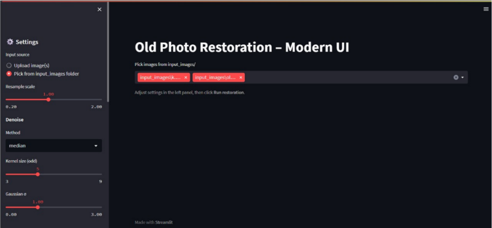
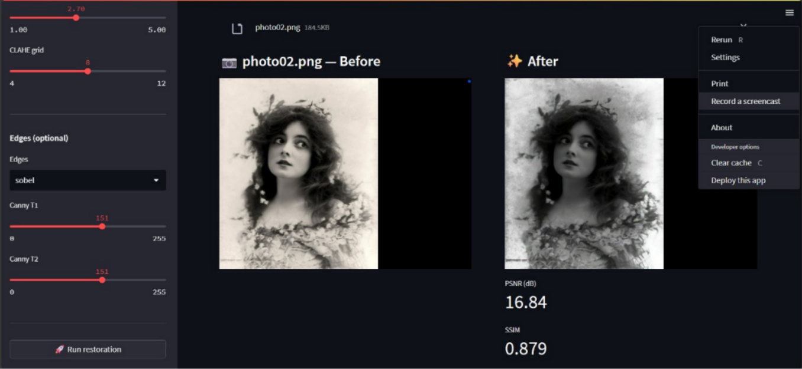
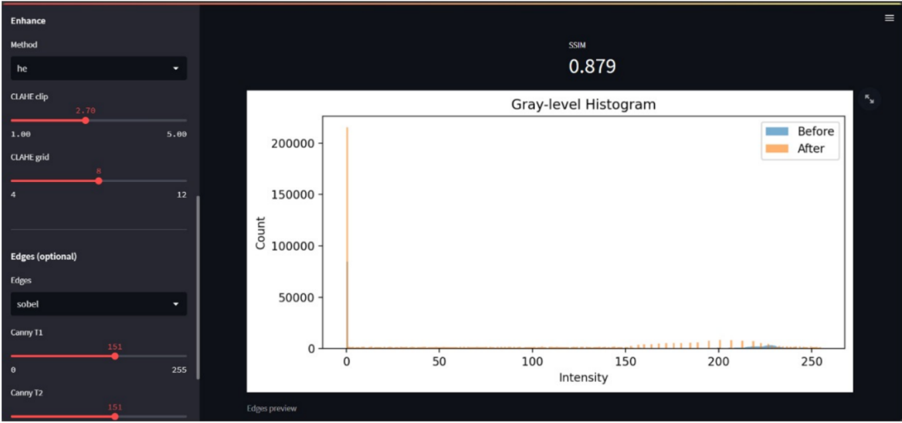

# Old Photo Restoration Tool

A Digital Image Processing (DIP) project that restores and enhances old photographs using traditional image processing techniques. The application provides an interactive Streamlit interface for image restoration, visualization, and quality evaluation.

## Features

- Upload old or damaged images
- Noise reduction
  - Median Filter
  - Gaussian Filter
- Contrast enhancement
  - Histogram Equalization (HE)
  - CLAHE
- Optional edge detection
  - Sobel
  - Canny
- Histogram visualization
- Before & After comparison
- PSNR and SSIM evaluation
- Export restoration results

## Technologies

- Python
- Streamlit
- OpenCV
- NumPy
- Matplotlib
- scikit-image

## Project Structure

```
OldPhotoRestorationProject
│
├── app.py
├── restoration_src/
├── input_images/
├── output_results/
├── requirements.txt
└── README.md
```

## Installation

```bash
git clone https://github.com/MaysAlsalum/OldPhotoRestorationProject.git
cd OldPhotoRestorationProject

python -m venv .venv
source .venv/bin/activate
# Windows
.venv\Scripts\activate

pip install -r requirements.txt
```

## Run

```bash
python -m streamlit run app.py
```

Then open:

```
http://localhost:8501
```

## Screenshots

### Main Interface



### Restoration Results



### Histogram



## Future Improvements

- Deep Learning restoration models
- Scratch removal
- Automatic parameter optimization
- Batch image restoration

## Authors

- Mays Alsalum
- Hailah Albijadi
- Maha Alotaibi

## Supervisor

Dr. Dimah Almani
